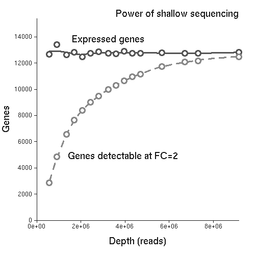

## [ExpCube vignette]
# Differential expression analysis using shallow sequencing

In this vignette we will use package ExpCube to explore a small dataset of 16 samples. We will aim to learn about how sequencing depth affects performance of differential expression analysis. We will start with raw expression data and finish with a visualization. 

We will use a dataset embedded into the package that was prepared as follows. Expression profiles of HAP1 cells were first measured using the QuantSeq protocol in 24 shallow replicates. This data was cleaned, pooled together, and then split into 16 bins to create synthetic samples mimicking sequencing runs of various depth (number of reads). Reads in each bin were aligned using GSNAP and expression quantified using Exp3p. 


## Getting started

We first need to load the package (if you need to install the package, uncomment the first two lines)


```r
## library("devtools")
## install_github("tkonopka/ExpCube")
library("ExpCube")
```

We will also need some other packages (from github and CRAN)


```r
library("Rcssplot")
library("data.table")
```

```
## data.table 1.9.6  For help type ?data.table or https://github.com/Rdatatable/data.table/wiki
## The fastest way to learn (by data.table authors): https://www.datacamp.com/courses/data-analysis-the-data-table-way
```


## Setting up

We will need two preliminary tables, which we will load from csv/tsv files stored in the `extdata` directory associated with the package. The filenames are
   

```r
summary.file = system.file("extdata", "PlateSeries.longsummary.csv", package="ExpCube")	
readcounts.file = system.file("extdata", "PlateSeries.readcounts.tsv", package="ExpCube")	
```

First, let's look at the sample definitions


```r
series.summary = E3LoadPlateConfig(summary.file)
```

```
## /software/opt/R/R-3.1.2/lib/R/library/ExpCube/extdata/PlateSeries.longsummary.csv
```

```r
samplenames = series.summary[,"Sample"]
```

Here, the ```E3LoadPlateConfig``` is just a wrapper for ```read.table```, but it is convenient if you've got multiple configuration files.


Next, let's get an object linking each sample to a sequencing depth (number of reads), and merge this with the previous table,


```r
readcounts = read.table(readcounts.file, header=T, stringsAsFactors=F)	
series.summary = merge(series.summary, readcounts, all.x =TRUE)
rownames(series.summary) = series.summary[,"Sample"]
series.summary = series.summary[samplenames,]
```

Here is a preview of the result


```r
head(series.summary[, c("Sample", "Plate.96well", "Reads")], n=4)
```

```
##                      Sample Plate.96well   Reads
## HAP1_PoolAB_1 HAP1_PoolAB_1       Series  566857
## HAP1_PoolAB_2 HAP1_PoolAB_2       Series  915359
## HAP1_PoolAB_3 HAP1_PoolAB_3       Series 1340940
## HAP1_PoolAB_4 HAP1_PoolAB_4       Series 1706182
```

(We will not need the other columns of the table)


## Analysis


### Using expression data

To start the analysis, we need to load expression profiles for our samples. These are stored in files in the `extdata` directory of the package with filenames starting with the sample name and ending with a suffix `exp3p.gene.txt.gz`. We will reach them by specifying a path template, 


```r
path.template = dirname(system.file("extdata", "PlateSeries.longsummary.csv", package="ExpCube"))
exp.template = paste0(path.template, "/PlateSeries/SAMPLE.exp3p.gene.txt.gz")
```

The text `SAMPLE` is here a placeholder; individual samplenames will be substituted into this template one by one. (A second allowed placeeholder is `PLATE`, which is convenient for larger datasets wherein samples are split by library preparation plate. ) We can now load the entire dataset with one command


```r
seriesdata = E3LoadExp3pGeneData(series.summary[,"Sample"], series.summary[,"Plate.96well"], exp.template)
```

The output object now contains all the expression profiles and expression intervals for the entire dataset. As an illustration, let's look at gene "MDM2", 


```r
MDM2.id = which(seriesdata$expression[,"Gene"] == "MDM2")	
seriesdata$expression[MDM2.id, 1:4]
```

```
##       Gene HAP1_PoolAB_1 HAP1_PoolAB_2 HAP1_PoolAB_3
## 17622 MDM2         118.1         146.3         148.3
```

We can see that the expression of sample 1 and sample 3 differ by a factor of 1.2. Let's keep that in mind as we peak into the low and high expression estimates for the same samples,


```r
seriesdata$expression.high[MDM2.id, 1:4]
```

```
##       Gene HAP1_PoolAB_1 HAP1_PoolAB_2 HAP1_PoolAB_3
## 17622 MDM2         133.7         159.5         159.1
```

```r
seriesdata$expression.low[MDM2.id, 1:4]
```

```
##       Gene HAP1_PoolAB_1 HAP1_PoolAB_2 HAP1_PoolAB_3
## 17622 MDM2         103.4         133.4         137.6
```

We see that the high estimate for sample 1 is slightly lower than the low estimate for sample 3; the two intervals do not overlap. This is suggestive that perhaps that the difference in expression for these two samples may be significant. 


### Adjusting expression intervals

The expression intervals in the `seriesdata` object are currently the ones obtained from the raw data files. (We loaded raw data from [exp3p](https://github.com/tkonopka/Exp3p) data files, so these intervals are based on a Poisson model of read counts. If you use data produced by other programs, the interpretation might be different). 
    
For various reasons, we might want to adjust these intervals. For example, we might want to widen intervals for genes that we believe are prone to batch effects. In this vignette we will not look at how to select such genes or how to decide how strong such adjustments should be. We will just load a set of adjustments from a data file


```r
rescale.file = system.file("extdata", "KiCube.rescaling.factor.discovery.csv", package="ExpCube")	
rescale.data = read.table(rescale.file, header=T, stringsAsFactors=F)
gene.rescaling = rescale.data[, "rescale.factor"]
names(gene.rescaling) = rescale.data[,"Gene"]
gene.rescaling["MDM2"]
```

```
##  MDM2 
## 5.007
```

Here, we see the suggested rescaling factor for gene MDM2 is around 5. We can now apply this rescaling to our samples


```r
seriesdata.rescaled = E3RescaleIntervals(seriesdata, samplenames, gene.rescaling)
```

Let's look at the effect of this operation on MDM2, 


```r
seriesdata.rescaled$expression[MDM2.id, 1:4]	
```

```
##       Gene HAP1_PoolAB_1 HAP1_PoolAB_2 HAP1_PoolAB_3
## 17622 MDM2         118.1         146.3         148.3
```

```r
seriesdata.rescaled$expression.low[MDM2.id, 1:4]	
```

```
##       Gene HAP1_PoolAB_1 HAP1_PoolAB_2 HAP1_PoolAB_3
## 17622 MDM2       39.9908       80.2076       94.2244
```

```r
seriesdata.rescaled$expression.high[MDM2.id, 1:4]
```

```
##       Gene HAP1_PoolAB_1 HAP1_PoolAB_2 HAP1_PoolAB_3
## 17622 MDM2      196.2092      212.3924      202.3756
```

Note how the base expression values are unchanged, but the interval are much wider than before. There is clear overlap between the intervals for samples 1 and 3. This is suggestive that the difference in expression may not be important/reproducible/significant after all.


### Modeling 

Let's use this dataset to learn how sequencing depth affects ability to perform expression analysis. To this end, let's create an auxilary dataset with additional samples. We will create these samples by shifting the profiles of our existing samples by a factor of 2. That is, the new samples will model an over-expression by a factor of 2. 


```r
seriesdata.OE = seriesdata.rescaled
for (nowsamp in samplenames) {
  nowvals = seriesdata.OE$expression[,nowsamp]
  for (k in c("expression", "expression.low", "expression.high")) {
    seriesdata.OE[[k]][,paste0(nowsamp, "_2")] =
            seriesdata.OE[[k]][,nowsamp]+nowvals;                
  } 
  rm(nowvals)	    
}
```

We will need a function to call differential expression. Let's use function `E3DEscore` from the package. It takes two primary arguments, a fold-change capturing effect size and a z-score capturing significance. It outputs a value in [-1, 1] scoring differential expression. (The function can be tuned through additional parameters, see documentation). Here are some examples of scores obtained through default settings


```r
E3DEscore(fc=c(2, 2, 1.5, 1.5, 0.5), z=c(2, 1.5, 2, 1.5, -2))
```

```
## [1]  1.00  0.50  0.50  0.25 -1.00
```

Now, let's compute the number of expressed genes in each sample (number of genes with expression above a threshold). At the same time, let's also compute the number of differentially expressed genes between our samples and the matching auxilary samples (number of genes with DE score above threshold)


```r
series.summary[,"ExpressedGenes"] = 0;
series.summary[,"useDE"] = 0;

min.expression = 1;    
min.DEscore = 0.7;

for (nowsamp in samplenames) {     
  nowexpressed = seriesdata.OE$expression[,nowsamp]>min.expression;         
  series.summary[nowsamp, "ExpressedGenes"] = sum(nowexpressed)
        
  temp = E3GetDEScores(seriesdata.OE, sampleA=paste0(nowsamp,"_2"),
      refsamples=nowsamp, scorefun=E3DEscore, shiftval=min.expression/100,
      rankrescale=FALSE)
  series.summary[nowsamp, "useDE"] = sum(abs(temp)>min.DEscore & nowexpressed)
     
  rm(nowexpressed, temp)
}
```

The results are now encoded into new columns of the `series.summary` table. 


```r
series.summary[,c("Sample", "Reads", "ExpressedGenes", "useDE")]
```

```
##                        Sample   Reads ExpressedGenes useDE
## HAP1_PoolAB_1   HAP1_PoolAB_1  566857          12666  2864
## HAP1_PoolAB_2   HAP1_PoolAB_2  915359          13405  4848
## HAP1_PoolAB_3   HAP1_PoolAB_3 1340940          12616  6572
## HAP1_PoolAB_4   HAP1_PoolAB_4 1706182          12839  7640
## HAP1_PoolAB_5   HAP1_PoolAB_5 2074692          12494  8398
## HAP1_PoolAB_6   HAP1_PoolAB_6 2440130          12767  9014
## HAP1_PoolAB_7   HAP1_PoolAB_7 2804399          12874  9481
## HAP1_PoolAB_8   HAP1_PoolAB_8 3232297          12735  9978
## HAP1_PoolAB_9   HAP1_PoolAB_9 3597440          12728 10311
## HAP1_PoolAB_10 HAP1_PoolAB_10 3959369          12905 10653
## HAP1_PoolAB_11 HAP1_PoolAB_11 4328832          12748 10940
## HAP1_PoolAB_12 HAP1_PoolAB_12 4692689          12767 11143
## HAP1_PoolAB_13 HAP1_PoolAB_13 5668177          12773 11728
## HAP1_PoolAB_14 HAP1_PoolAB_14 6699586          12766 12070
## HAP1_PoolAB_15 HAP1_PoolAB_15 7310787          12730 12160
## HAP1_PoolAB_16 HAP1_PoolAB_16 9141019          12825 12487
```

The number of genes detected as "expressed" is roughly constant, around 12,000, for all samples regardless of sequencing depth. The number of genes that are detected as differential expressed, in contrast, rises steadily with sequencing depth (reads). 


## Visualization

As a final component of this vignette, let's visualize the modeling results. Let's make a line chart showing the two series we just computed. 


```r
myRcss = Rcss(system.file("extdata", "ExpCube.Rcss", package="ExpCube"))
RcssSetDefaultStyle(myRcss)

E3PlotLines(series.summary, xcolumn="Reads",
            ycolumns=c("ExpressedGenes", "useDE"), lineclass=c("EX", "DE"),
            legend=c("Expressed genes", "Genes detectable at FC=2"), legend.at = c(8,2),
            xlab="Depth (reads)", ylab="Genes", main="Power of shallow sequencing",
            Rcss=myRcss, Rcssclass="plotline")
```

 

The first group of statements defines a plotting style used by [Rcssplot](https://github.com/tkonopka/Rcssplot). The last command should display a graph with two series, including smoothed lines.

&nbsp;

&nbsp;

&nbsp;

